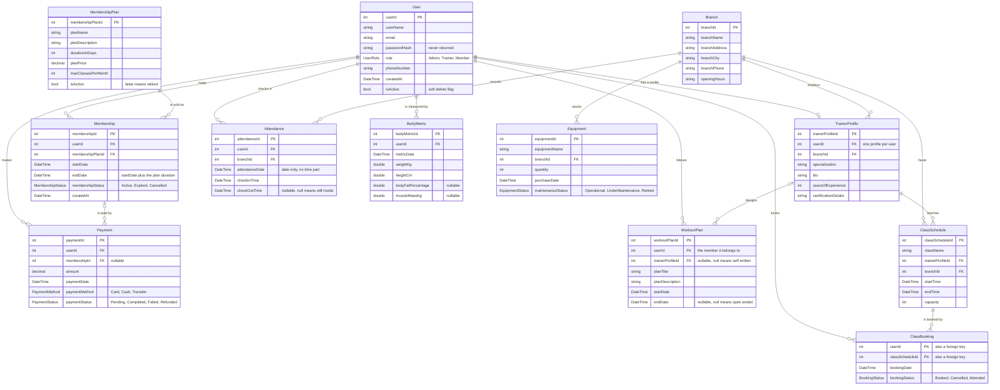
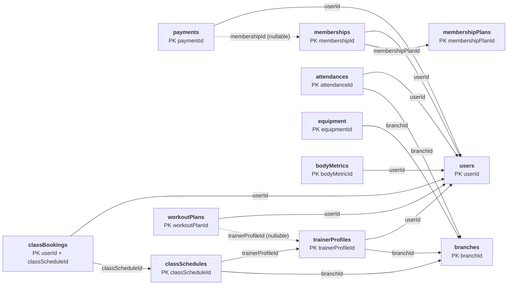

# Gym & Fitness Club Management

A full-stack gym management system: an ASP.NET Core REST API backed by SQL Server, with a Bootstrap front end served from the same origin.

It covers the day-to-day running of a multi-branch fitness club: registering members, selling and renewing memberships, taking payments, scheduling classes and bookings, tracking gym check-ins, logging body measurements, assigning workout plans, and managing equipment and staff across branches.

---

## Contents

- [Features](#features)
- [Tech stack](#tech-stack)
- [Getting started](#getting-started)
- [Project structure](#project-structure)
- [Data model](#data-model)
- [API](#api)
- [Authentication and roles](#authentication-and-roles)
- [Email service](#email-service)
- [Front end](#front-end)
- [Business rules](#business-rules)
- [Code conventions](#code-conventions)

---

## Features

| Area | What it does |
|---|---|
| **Users** | Registration with hashed passwords, role assignment, soft delete (deactivate rather than remove) |
| **Trainers** | Trainer profiles linked to a user and a branch, with specialization and experience; transfer between branches |
| **Branches** | Multiple locations with addresses, phone numbers and opening hours; staff counts per branch |
| **Membership plans** | Priced tiers with a duration in days and a monthly class allowance; retire a plan without deleting it |
| **Memberships** | Enrol a member on a plan, renew by adding days, cancel; end dates are calculated by the server |
| **Payments** | Record payments against a member and optionally a membership, confirm or fail them, and report revenue |
| **Class schedules** | Classes with a trainer, branch, time slot and capacity; reassign a trainer without recreating the class |
| **Class bookings** | Book a member into a class, move them to another class, cancel, or mark them attended |
| **Attendance** | Check-in and check-out with duration, a live "currently in the gym" view, and per-branch daily averages |
| **Body metrics** | Weight, height, body fat and muscle mass over time, with a per-member progress summary |
| **Workout plans** | Programmes assigned to a member, optionally written by a trainer, with open-ended or fixed end dates |
| **Equipment** | Per-branch inventory with quantities, purchase dates and a maintenance status |
| **Dashboard** | Six live report blocks summarising revenue, members, expiring memberships, plans, equipment and attendance |
| **Email** | SMTP notifications through MailKit, wired into membership activation and class booking confirmation |

---

## Tech stack

**Backend**

- ASP.NET Core (.NET 10) Web API
- Entity Framework Core 10 with SQL Server
- JWT bearer authentication
- BCrypt.Net for password hashing
- MailKit for SMTP email
- Swashbuckle / Swagger UI for API documentation

**Frontend**

- Static HTML served from `wwwroot`, on the same origin as the API
- Bootstrap 5.3 from CDN, plus one shared stylesheet
- Plain JavaScript, with no framework, no build step and no bundler

---

## Getting started

### Prerequisites

- .NET 10 SDK
- SQL Server (Express is fine) or LocalDB
- Visual Studio 2022+ (optional, the CLI works just as well)
- `dotnet-ef` tools, if you are using the CLI and need to create or apply migrations:

  ```bash
  dotnet tool install --global dotnet-ef
  ```

  Not needed in Visual Studio: the Package Manager Console already has the EF commands.

### 1. Configure

Edit `GFCM/appsettings.json`:

```jsonc
{
  "ConnectionStrings": {
    // point this at your SQL Server instance
    "DefaultConnection": "Server=.\\SQLEXPRESS;Database=GymDB;Trusted_Connection=True;TrustServerCertificate=True;"
  },
  "Jwt": {
    "Key": "<at least 32 characters, random>",
    "Issuer": "GymManagementApi",
    "Audience": "GymManagementClient",
    "ExpiryMinutes": 60
  },
  "EmailConfiguration": {
    "From": "REPLACE_ME",
    "SenderName": "Gym & Fitness Club",
    "SmtpServer": "smtp.ethereal.email",
    "Port": 587,
    "UserName": "REPLACE_ME",
    "Password": "REPLACE_ME"
  }
}
```

The JWT key is required and must be at least 32 characters, and startup throws without it. The email settings can stay as placeholders; only the notification features use them.

### 2. Create the database

**Visual Studio**: open `GFCM.slnx`, then go to
*Tools → NuGet Package Manager → Package Manager Console* and run:

```powershell
Update-Database
```

**Command line**: from the repository root:

```bash
cd GFCM
dotnet ef database update
```

Either way applies the existing migrations and creates `GymDB` with all twelve tables.

### 3. Run

**Visual Studio**: press **F5** (or Ctrl+F5 to run without debugging). The `https`
profile starts the app on `https://localhost:7130` and opens Swagger automatically.

**Command line**:

```bash
cd GFCM
dotnet run
```

Either way, these are the two places to look:

- **`/`**: the web app (redirects to the login page when signed out)
- **`/swagger`**: interactive API documentation, development environment only

### 4. Create the first account

Open `/register.html` and create an account with the role **Admin**. Registration is the only anonymous write endpoint, so the first account has to be made there. Admin matters because the Users and Payments sections are admin-only.

---

## Project structure

```
Gym-Fitness-Club-Management/
├── ERD.png                     entity relationship diagram
├── ErdMapping.png              relational mapping
└── GFCM/
    ├── Controllers/            one controller per resource, 13 in total
    ├── Models/                 entities, enums and the two input-only classes
    ├── Migrations/             EF Core migrations
    ├── Services/               JWT token generation and SMTP email
    ├── ProjectContext.cs       the DbContext, one DbSet per entity
    ├── Program.cs              DI, JWT pipeline, Swagger, static files
    ├── appsettings.json        connection string, JWT and email settings
    └── wwwroot/
        ├── index.html          dashboard
        ├── login.html
        ├── register.html
        ├── css/site.css        the single shared stylesheet
        ├── js/                 one script per page, plus shared helpers
        └── pages/              the twelve management pages
```

The layout is deliberately flat: no `Data/` folder, no `Dtos/` folder, no repository layer. Controllers use the `DbContext` directly.

---

## Data model

Twelve entities. The original design diagrams are at the repository root: `ERD.png`
(Chen notation) and `ErdMapping.png` (relational mapping). The two diagrams below
are the same thing as built, using the implemented property names.

### Entity relationship diagram



### Relational mapping

The twelve tables as EF Core creates them, with every foreign key labelled by the
column that carries it.



Solid arrows are required foreign keys, dotted arrows are optional ones.

Relationships worth knowing:

- **TrainerProfile** is the join between a user and a branch. A user with the Trainer role is not yet a trainer, because classes are scheduled against the profile, not the user.
- **ClassBooking** has a composite primary key of `userId` + `classScheduleId`, so the same member cannot be booked into one class twice.
- **Payment.membershipId** is nullable, so a payment can exist without a membership.
- **WorkoutPlan.trainerProfileId** is nullable, where null means the member wrote the plan themselves.
- **Attendance.checkOutTime** is nullable, where null means the member is in the gym right now. That is what the live view and the open-session guard both read.

Every fixed set of values is an enum, so a typo can never reach the database: `UserRole`, `MembershipStatus`, `PaymentMethod`, `PaymentStatus`, `EquipmentStatus`, `BookingStatus`.

---

## API

98 endpoints across 13 controllers. Every resource controller has the same eight-endpoint shape, so learning one teaches you all of them:

| Verb | Route | Purpose |
|---|---|---|
| `POST` | `/{resource}/add` | create |
| `PUT` | `/{resource}/update` | full update |
| `PATCH` | `/{resource}/update…` | one targeted field |
| `DELETE` | `/{resource}/remove` | delete, **Admin only** |
| `GET` | `/{resource}/getAll` | list |
| `GET` | `/{resource}/get` | one by id |
| `GET` | `/{resource}/get…` | filtered search |
| `GET` | `/{resource}/count…` | aggregate report |

### Resources

| Route prefix | Targeted update | Search | Report |
|---|---|---|---|
| `/auth` | n/a | n/a | `POST /auth/login` |
| `/user` | `updateRole` | `getByRole` | `countByRole` |
| `/trainerprofile` | `updateBranch` | `getBySpecialization` | `getByExperience` |
| `/branch` | `updateHours` | `getByCity` | `staffCount` |
| `/membershipplan` | `updateStatus` | `getByPrice` | `getPopular` |
| `/membership` | `updateStatus` | `getExpiring` | `countByPlan` |
| `/payment` | `updateStatus` | `getByDate` | `totalRevenue` |
| `/classschedule` | `updateTrainer` | `getByDate` | `getBookingCount` |
| `/classbooking` | `updateStatus` | `getByUser`, `getByStatus` | `countByClass` |
| `/attendance` | `updateCheckOut` | `getByDate` | `averagePerBranch` |
| `/bodymetric` | `updateWeight` | `getByUser` | `getSummary` |
| `/workoutplan` | `updateTrainer` | `getByUser` | `getActive` |
| `/equipment` | `updateStatus` | `getByBranch` | `countByStatus` |

Full request and response shapes are in Swagger at `/swagger` while running in development.

---

## Authentication and roles

- `POST /auth/login` verifies the email and the BCrypt password hash, checks the account is active, and returns a JWT valid for two hours.
- The token carries the user id, email and role as claims.
- Every controller carries `[Authorize]` at class level, so by default every endpoint needs a valid token.
- Exactly two endpoints override that with `[AllowAnonymous]`, because they have to work before a token exists:

  | Endpoint | Attribute | Why it is open |
  |---|---|---|
  | `POST /auth/login` | `[AllowAnonymous]` on the action | You cannot get a token without calling it |
  | `POST /user/add` | `[AllowAnonymous]` on the action, inside an `[Authorize]` controller | Registration, so the first account can be created on an empty database |

  Everything else on `UserController` still requires a token. `[AllowAnonymous]` on a
  single action wins over `[Authorize]` on the controller, which is what lets one
  endpoint stay public while its eleven neighbours stay locked.

- Every `DELETE` endpoint adds `[Authorize(Roles = "Admin")]`.
- The front end keeps the token in `localStorage` and sends it as a `Bearer` header on every request. A `401` clears the token and returns to the login page.
- The navigation bar is built from the stored role, so admin-only sections do not render for other users. That is convenience, not security. The API enforces the real rules.

Three roles: **Admin**, **Trainer**, **Member**.

---

## Email service

Transactional email is sent over SMTP using MailKit. All of the sending logic lives
in one service, so no controller ever builds an email itself.

### How it works

1. `EmailConfiguration` is a plain settings class. It is not an entity, has no table
   and no DbSet. It just holds the six SMTP values.
2. At startup, `Program.cs` reads the `EmailConfiguration` section of the config into
   that class, registers it as a singleton, and registers `EmailService` as a scoped
   service, so a controller can inject it exactly like the DbContext.
3. Every email goes through one low level method, `sendEmail(to, subject, htmlBody)`.
   It builds a `MimeMessage`, connects to the SMTP server with StartTls,
   authenticates, sends and disconnects.
4. Each individual email is a template method on the same service, which assembles
   its own HTML body and calls `sendEmail`. Restyling every email in the project
   means editing one file.

Two design points that surprise people:

- **Failures are silent.** `sendEmail` wraps everything in a try/catch and only writes
  to the console. A mail failure must never break the request that triggered it,
  because by the time the email is sent the membership is already saved, and turning
  that into a 500 would be worse than a missing email. A 200 response therefore does
  not prove the email went out. The terminal is the only signal.
- **Bodies are inline styled HTML.** Email clients ignore stylesheets and most modern
  CSS, so every template uses `style` attributes. Do not try to reuse Bootstrap classes.

### The file you have to create

`GFCM/appsettings.json` is committed with `REPLACE_ME` placeholders instead of real
secrets. The real credentials go in a second file that is listed in `.gitignore` and
is deliberately not in the repository, so **each developer creates it once**:

**`GFCM/appsettings.Development.json`**

```json
{
  "EmailConfiguration": {
    "From": "yourname@ethereal.email",
    "UserName": "yourname@ethereal.email",
    "Password": "your-password"
  }
}
```

Only the three secret values need to go here. `SenderName`, `SmtpServer` and `Port`
are already in the committed file and are inherited.

If you clone the project and email silently does nothing, this missing file is almost
always the reason.

### Files involved

| File | What it does |
|---|---|
| `Services/EmailConfiguration.cs` | Plain class holding the SMTP values |
| `Services/EmailService.cs` | The sender, plus one template method per email |
| `appsettings.json` | Committed settings, with placeholders instead of secrets |
| `appsettings.Development.json` | Your real credentials. Gitignored, you create this |
| `Program.cs` | Two lines registering the config and the service |

### Registration in `Program.cs`

Already wired, shown here so you know where it comes from:

```csharp
var emailConfig = builder.Configuration
    .GetSection("EmailConfiguration")
    .Get<EmailConfiguration>();

builder.Services.AddSingleton(emailConfig!);
builder.Services.AddScoped<EmailService>();
```

### Calling it from a controller

Two steps. First inject the service alongside the context:

```csharp
private ProjectContext context;
private EmailService emailService;

public MembershipController(ProjectContext context, EmailService emailService)
{
    this.context = context;
    this.emailService = emailService;
}
```

Then call the template method after `SaveChanges()` and before the return, so nobody
is told about something that did not persist:

```csharp
context.memberships.Add(membership);
context.SaveChanges();

emailService.sendMembershipActivation(user, plan, membership.endDate);

return Ok(new { message = "Membership created", membership.membershipId });
```

Remember `using GFCM.Services;` at the top of the controller.

### Templates

| Method | Sends | Status |
|---|---|---|
| `sendMembershipActivation` | Welcome message with the plan name and end date | Live, fires from `POST /membership/add` |
| `sendClassBookingConfirmation` | Class name and start time | Live, fires from `POST /classbooking/add` |
| `sendMembershipCancelled` | Cancellation notice | Stub, empty body, not called yet |
| `sendRenewalReminder` | Expiry warning | Stub, empty body, not called yet |
| `sendPaymentReceipt` | Payment receipt | Stub, empty body, not called yet |

The three stubs already have their method signature and subject line. Fill in the HTML
body and add the call site when you need one.

### Testing with Ethereal

Ethereal gives you working SMTP credentials instantly with no signup and captures
everything the app sends into a web viewer, so nothing reaches a real inbox.

1. Go to [ethereal.email](https://ethereal.email) and click **Create Ethereal Account**.
2. Put the username and password into your `appsettings.Development.json`.
3. Run the project and keep the terminal visible.
4. In Swagger, trigger the action. For the activation email that is
   `POST /membership/add` with `{ "userId": 1, "membershipPlanId": 1 }`.
5. Log in at ethereal.email with the same credentials and open **Messages**.

Watch the **Messages** tab, not Inbox. Ethereal has inbound mail disabled, so the inbox
shows an error. These emails are outbound and appear under Messages.

| Terminal shows | Meaning |
|---|---|
| `535 Authentication failed` | Wrong credentials. Check that `From` and `UserName` are both the full address |
| A long pause, then a timeout | Stuck connecting. Check `SmtpServer` and that `Port` is 587 |
| Nothing at all | The send was never reached, or the file was not saved before running. Save all, rebuild, retry |

### Switching to real delivery

For a live demo you can point at a real Gmail account. No code changes are needed,
only the config values.

1. Create a throwaway Gmail account for the project.
2. Turn on 2-Step Verification. The App passwords option does not appear without it.
3. Under Security, App passwords, generate one. You get a 16 character string.
4. Use that string as the password, not the account password.
5. Set `SmtpServer` to `smtp.gmail.com`. Port stays 587.

### Rules

- Never write MailKit code in a controller. Add a template method to `EmailService`
  and call that instead.
- Never commit real credentials. Once a password is committed it stays in git history
  even if you delete it later.
- Send after the save, not before.
- A 200 response does not mean the email sent. Check the terminal.
- One activation email only. It fires at enrolment (`POST /membership/add`), not at
  registration, so a member does not receive two.

---

## Front end

No framework and no build step. Every page loads Bootstrap, the shared stylesheet, and its own script.

Shared scripts:

| File | Responsibility |
|---|---|
| `js/api.js` | `fetch` wrapper that attaches the token, parses the response and throws on failure |
| `js/auth.js` | login, registration, logout, and the `requireAuth()` route guard |
| `js/nav.js` | builds the navigation bar and hides admin-only links |
| `js/ui.js` | toasts, confirm dialogs, status badges, date and money formatting |

Each management page has one matching script: `pages/branch.html` with `js/branch.js`, and so on. All of them follow the same pattern: a filter bar, a table, and Bootstrap modals for create and edit.

One thing to know when reading the page scripts: the aggregate report endpoints project into anonymous objects, which drops the string enum converter, so enums arrive from those endpoints as numbers. The pages that read them map the numbers back to names.

---

## Business rules

The rules live in the controllers, not in the forms, so the same checks apply whether a request comes from the web app or straight from Swagger.

- A member cannot check in twice without checking out first
- A class cannot be booked past its capacity, and capacity cannot be lowered below the number of existing bookings
- A trainer cannot have two classes in overlapping time slots
- A branch cannot be deleted while trainers, classes or equipment reference it
- A completed payment cannot be edited or deleted
- A retired plan cannot be sold
- A cancelled membership cannot be renewed
- A membership with payment history cannot be deleted, only cancelled
- A trainer cannot be removed until their classes are reassigned
- Equipment cannot take a future purchase date or a negative quantity
- A class must end after it starts, and a workout plan cannot end before it starts
- Deactivating a user keeps the row and blocks login, instead of deleting history

Membership end dates, attendance durations and revenue totals are always calculated on the server, never sent by the client.

---

## Code conventions

The codebase follows one style throughout:

- **camelCase properties**, prefixed with the entity name where it aids clarity (`userId`, `branchName`, `planPrice`). Class names stay PascalCase.
- **Relationships are declared on the model** with data annotations: `[Key]`, `[Required]`, `[ForeignKey]`, `[InverseProperty]`, `[PrimaryKey]`. There is no Fluent API and no `OnModelCreating` body.
- **`[JsonIgnore]` replaces DTOs.** Primary keys and navigation properties are hidden in both directions, so a client never sends an id and a response never loops through relationships. Endpoints that need related data project it explicitly into an anonymous object.
- **Two input-only classes**, `UserRegister` and `UserLogin`, exist only because a password must be receivable but never returnable. They are the sole exception to binding entities directly.
- **Enums with `JsonStringEnumConverter`**, so a status reads as `"Active"` rather than `0` in responses and in Swagger.

---

## Notes

- `appsettings.json` ships with placeholder credentials. Replace the JWT key and the email settings before running anywhere but a local machine.
- Swagger is mapped only in the development environment.
- The API and the front end share an origin, so no CORS configuration is needed.
